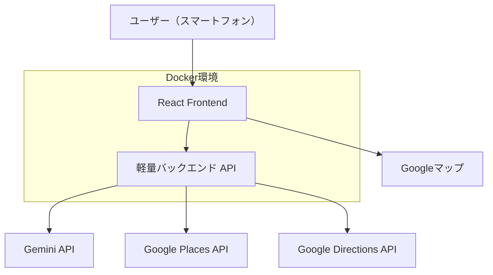

# 設計書

## 概要

「ご飯探索マップ」は、React + Vite + TailwindCSS + Dockerで構築されるスマートフォン対応のWebアプリケーションです。ユーザーの気分をGemini APIで検索タグに変換し、Google Places APIで飲食店を検索する機能を提供します。セキュリティを考慮してAPIキーはバックエンド経由で呼び出し、モバイルファーストのUXを実現します。

## アーキテクチャ

### システム構成図



### レイヤー構成

1. **プレゼンテーション層**: React + TailwindCSS
2. **ビジネスロジック層**: Custom Hooks + Context API
3. **データアクセス層**: 軽量バックエンドAPI（Express.js）
4. **外部API層**: Gemini API, Google Places API, Google Directions API

## コンポーネントとインターフェース

### フロントエンド コンポーネント構成

```
src/
├── components/
│   ├── SearchForm.jsx          # 検索フォーム（モード切替含む）
│   ├── ModeToggle.jsx          # モード切替UI
│   ├── MoodInput.jsx           # 気分入力フィールド
│   ├── RadiusSlider.jsx        # 半径指定スライダー
│   ├── StationCounter.jsx      # 駅数指定UI
│   ├── ResultCard.jsx          # 検索結果カード
│   ├── ResultList.jsx          # 結果一覧表示
│   ├── Loader.jsx              # ローディング表示
│   └── ErrorMessage.jsx        # エラー表示
├── hooks/
│   ├── useGeolocation.js       # 位置情報取得
│   ├── useMoodConversion.js    # 気分→タグ変換
│   ├── usePlacesSearch.js      # 飲食店検索
│   ├── useStationSearch.js     # 駅検索・ルート取得
│   └── useSearchState.js       # 検索状態管理
├── context/
│   └── SearchContext.jsx       # グローバル検索状態
├── services/
│   └── api.js                  # バックエンドAPI呼び出し
├── utils/
│   ├── constants.js            # 定数定義
│   └── helpers.js              # ヘルパー関数
├── pages/
│   └── Home.jsx                # メインページ
└── App.jsx                     # アプリケーションルート
```

### バックエンド API構成

```
api/
├── routes/
│   ├── mood.js                 # 気分変換エンドポイント
│   ├── places.js               # 飲食店検索エンドポイント
│   └── stations.js             # 駅検索エンドポイント
├── services/
│   ├── geminiService.js        # Gemini API呼び出し
│   ├── placesService.js        # Google Places API呼び出し
│   └── directionsService.js    # Google Directions API呼び出し
├── middleware/
│   ├── cors.js                 # CORS設定
│   └── errorHandler.js         # エラーハンドリング
└── server.js                   # Express サーバー
```

### 主要インターフェース

#### SearchState Interface
```typescript
interface SearchState {
  mode: 'radius' | 'station';
  mood: string;
  radius: number;
  stationCount: number;
  location: GeolocationCoordinates | null;
  results: RestaurantResult[];
  loading: boolean;
  error: string | null;
}
```

#### RestaurantResult Interface
```typescript
interface RestaurantResult {
  placeId: string;
  name: string;
  rating: number;
  priceLevel: number;
  types: string[];
  vicinity: string;
  photos: string[];
  distance?: number;
  nearestStation?: string;
  googleMapsUrl: string;
}
```

## データモデル

### 検索パラメータ
```typescript
interface SearchParams {
  mood: string;
  mode: 'radius' | 'station';
  location: {
    lat: number;
    lng: number;
  };
  radius?: number;
  stationCount?: number;
}
```

### API レスポンス形式

#### 気分変換API
```json
{
  "originalMood": "疲れた時に食べたい温かいもの",
  "searchTags": ["ラーメン", "うどん", "鍋", "温かい料理"],
  "searchQuery": "ラーメン OR うどん OR 鍋 OR 温かい料理"
}
```

#### 飲食店検索API
```json
{
  "results": [
    {
      "placeId": "ChIJ...",
      "name": "○○ラーメン",
      "rating": 4.2,
      "priceLevel": 2,
      "types": ["restaurant", "food"],
      "vicinity": "東京都渋谷区...",
      "photos": ["photo_reference_1"],
      "distance": 350,
      "googleMapsUrl": "https://www.google.com/maps/search/..."
    }
  ],
  "status": "OK"
}
```

## エラーハンドリング

### エラー分類と対応

1. **位置情報エラー**
   - ユーザーが位置情報を拒否した場合
   - 位置情報の取得に失敗した場合
   - 対応: 手動で住所入力するオプションを提供

2. **API呼び出しエラー**
   - Gemini API の呼び出し失敗
   - Google Places API の呼び出し失敗
   - 対応: リトライ機能とフォールバック検索

3. **ネットワークエラー**
   - インターネット接続の問題
   - 対応: オフライン表示とリトライボタン

4. **データ検証エラー**
   - 不正な入力値
   - 対応: バリデーションメッセージの表示

### エラー表示戦略
- 非侵入的なトースト通知
- インライン エラーメッセージ
- リトライボタンの提供
- ユーザーフレンドリーなエラーメッセージ

## テスト戦略

### テスト分類

1. **ユニットテスト**
   - Custom Hooks のテスト（Jest + React Testing Library）
   - ユーティリティ関数のテスト
   - API サービス関数のテスト

2. **コンポーネントテスト**
   - 各Reactコンポーネントの描画テスト
   - ユーザーインタラクションのテスト
   - プロップスの受け渡しテスト

3. **統合テスト**
   - API エンドポイントのテスト
   - フロントエンド・バックエンド間の通信テスト

4. **E2Eテスト**
   - 主要ユーザーフローのテスト
   - モバイル端末での動作テスト

### テスト環境
- **フロントエンド**: Jest + React Testing Library + MSW
- **バックエンド**: Jest + Supertest
- **E2E**: Playwright（モバイル端末エミュレーション含む）

### モックデータ戦略
- Google Places API のレスポンスをモック
- Gemini API のレスポンスをモック
- 位置情報APIのモック

## 技術的考慮事項

### パフォーマンス最適化

1. **フロントエンド最適化**
   - React.memo でコンポーネントの再レンダリング防止
   - useMemo, useCallback でパフォーマンス最適化
   - 画像の遅延読み込み（Lazy Loading）
   - バンドルサイズの最適化（Tree Shaking）

2. **API呼び出し最適化**
   - デバウンス処理で不要なAPI呼び出しを削減
   - キャッシュ機能でレスポンス時間短縮
   - 並列API呼び出しで処理時間短縮

### セキュリティ対策

1. **APIキー保護**
   - 環境変数での管理
   - バックエンド経由でのAPI呼び出し
   - CORS設定でオリジン制限

2. **入力値検証**
   - フロントエンド・バックエンド両方での検証
   - SQLインジェクション対策（該当する場合）
   - XSS対策

### モバイル対応

1. **レスポンシブデザイン**
   - TailwindCSS のブレークポイント活用
   - フレキシブルレイアウト
   - タッチフレンドリーなUI要素

2. **パフォーマンス**
   - 軽量なバンドルサイズ
   - 効率的な画像配信
   - プログレッシブローディング

### Docker環境設計

1. **開発環境**
   - ホットリロード対応
   - ボリュームマウントでファイル同期
   - 環境変数の適切な管理

2. **本番環境想定**
   - マルチステージビルド
   - 最小限のイメージサイズ
   - セキュリティベストプラクティス